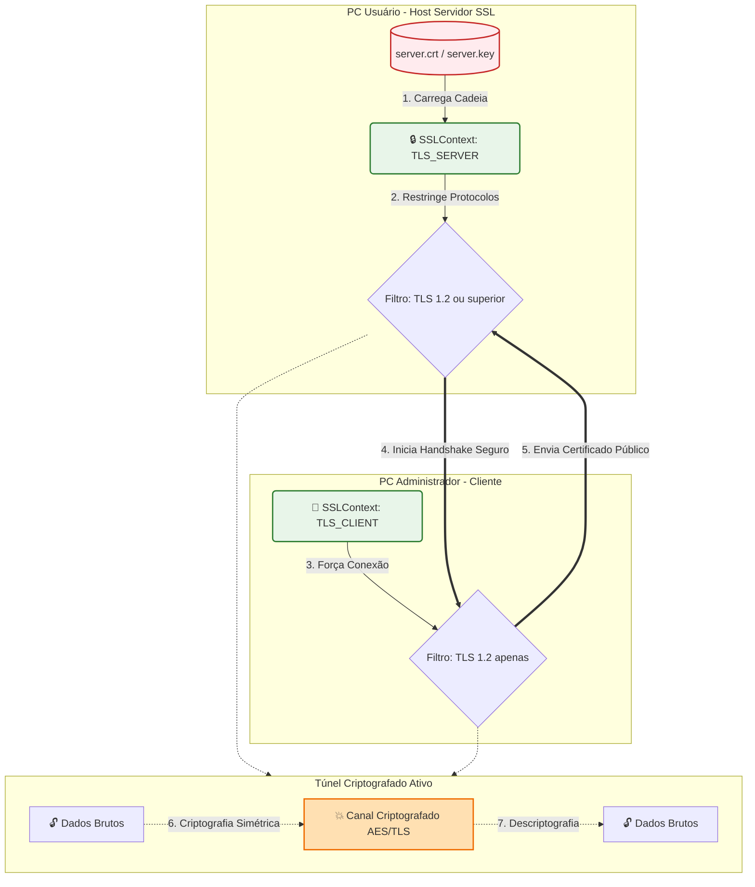
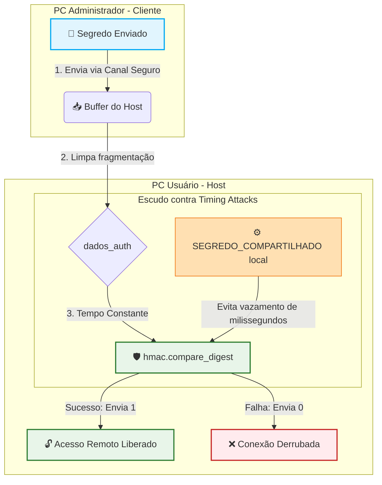
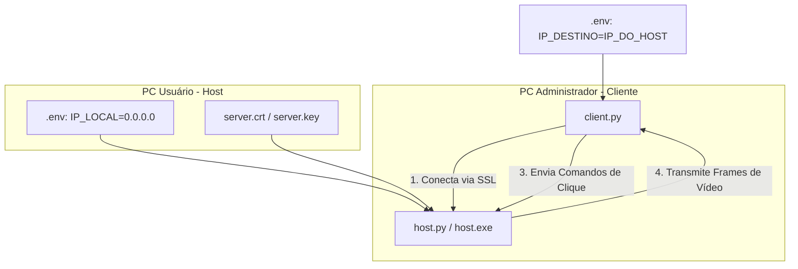
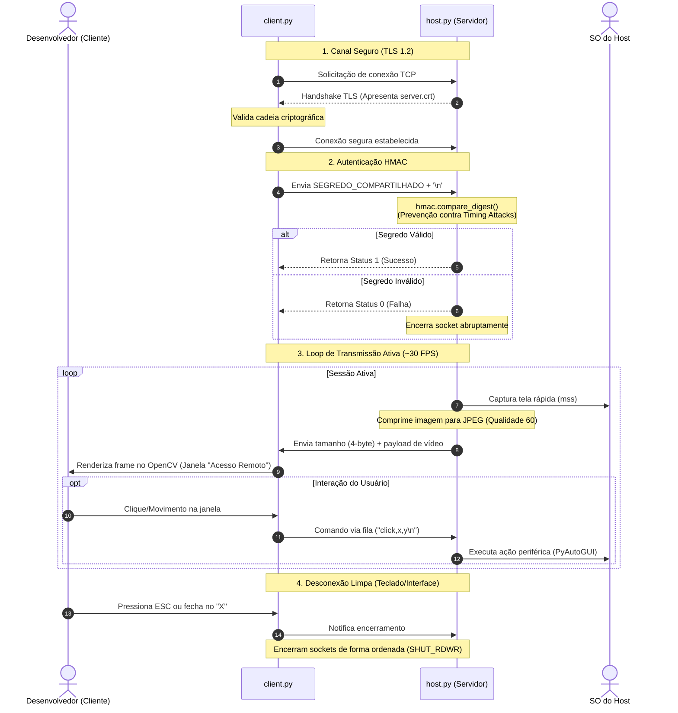

  
  
  
  

<h2 align="center">🖥️ Remote Desktop — Secure Control Hub 🖥️</h2>

---

## 🎯 Objetivo do Projeto

Um sistema ultraveloz e seguro de controle e visualização de desktop remoto desenvolvido em Python. Projetado para redes locais (LAN), o projeto estabelece uma conexão cliente-servidor robusta baseada em sockets criptografados nativamente com segurança de transporte TLS 1.2 e autenticação simétrica contra ataques de temporização (*timing attacks*). O host transmite capturas de tela fluidas enquanto interpreta cliques e ações periféricas recebidas diretamente do painel do cliente.

---

## ✨ Funcionalidades

```mermaid
graph LR
    subgraph Host [PC Usuário - Host]
        direction TB
        A[🖥️ Tela do OS] -->|1. Captura Direta| B(📸 mss.MSS)
        B -->|2. Frame Bruto| C(🔢 NumPy Array)
        C -->|3. Compressão JPG 60%| D(🖼️ OpenCV: imencode)
        D -->|4. Empacotamento| E(📦 struct.pack)
    end

    subgraph Cliente [PC Administrador - Cliente]
        direction TB
        F(📥 struct.unpack) -->|5. Buffer em Memória| G(🧱 np.frombuffer)
        G -->|6. Decodificação| H(🎨 OpenCV: imdecode)
        H -->|7. Exibição Fluida| I[📺 Janela: imshow]
    end

    %% Transmissão de Rede %%
    E ===>|🔒 Túnel SSL/TLS - LAN| F

    %% Estilização para ficar bonito %%
    style A fill:#f5f5f5,stroke:#333,stroke-width:2px
    style B fill:#e1f5fe,stroke:#03a9f4,stroke-width:1px
    style D fill:#ffe0b2,stroke:#ff9800,stroke-width:2px
    style H fill:#ffe0b2,stroke:#ff9800,stroke-width:2px
    style I fill:#e8f5e9,stroke:#4caf50,stroke-width:2px
```

* **Transmissão Fluida de Tela (30 FPS)**: Uso do wrapper de captura nativo de alta velocidade `mss` integrado à decodificação de imagem em memória do OpenCV, limitando o estresse de CPU no host através de compressão dinâmica para JPEG com qualidade otimizada.

* **Criptografia TLS 1.2 de Ponta a Ponta**: Camada de rede blindada por meio do módulo `ssl`, exigindo carregamento obrigatório de cadeia de certificados locais (`server.crt`/`server.key`) e restringindo protocolos legados ou inseguros.

* **Autenticação Resiliente `hmac`**: Prevenção ativa contra ataques de dicionário e de força bruta através do método seguro `hmac.compare_digest` para validação do segredo compartilhado.
* **Segurança de Conexão e Port-Scanning**: Mecanismos de timeout estrito (máximo de 8 segundos para envio da credencial) que previnem conexões fantasmas (*Slowloris*) e travamentos de socket por fragmentação TCP.
* **Interação Direta e Mouse-Tracking**: Mapeamento e encapsulamento em tempo real de cliques via fila de execução (`queue.Queue`) e simulação instantânea de mouse no sistema operacional do host utilizando PyAutoGUI.
* **Resiliência de Encerramento**: Interrupção limpa de conexões (`socket.SHUT_RDWR`) e descarte ordenado de threads tanto via comandos visuais (pressionando a tecla `ESC` ou fechando a janela de vídeo) quanto por desligamento via terminal (`Ctrl+C`).

### 📊 Arquitetura de Conexão Direta

## 🔄 Fluxo de Comunicação e Segurança

O diagrama abaixo ilustra o ciclo de vida de uma sessão, desde o aperto de mão (handshake) TLS até a transmissão contínua de frames e eventos de periféricos:

